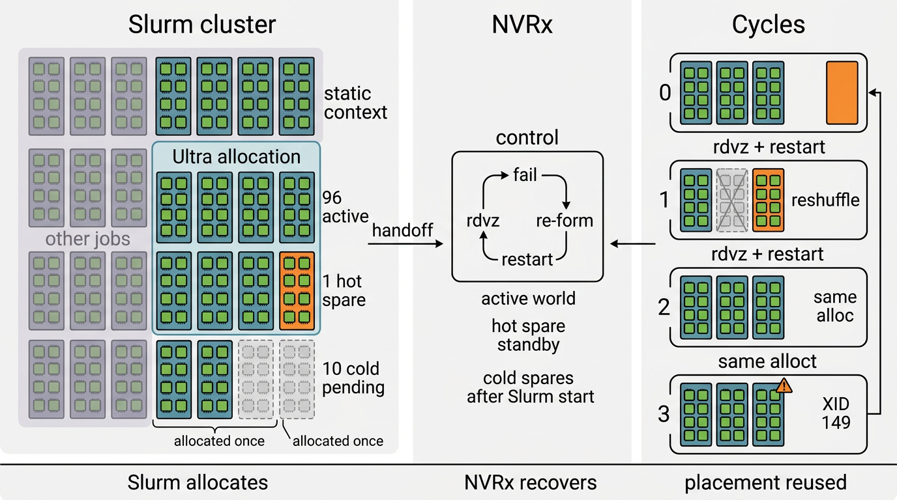

# Nemotron Ultra 3 Training with NVRx

This note analyzes the 2026-01-27 in-job experiment using the deck, the current NVRx codebase, and relevant git history.

## Run Configuration

| Item | Value | Source |
| --- | --- | --- |
| Slurm job | `1617268` | deck |
| Array launch | `0-106%97` | deck |
| Array tasks | `107` | deck |
| Segment size | `16 nodes` per task | deck |
| Active tasks | `96` | deck |
| Hot spare | `1` | deck |
| Cold spares | `10` | deck |

The deck describes one 16-node rack per array task. With `0-106%97`, the steady state was `96` active tasks, `1` running hot spare, and `10` pending cold spares.

## System Diagram

The left panel is static cluster context. Slurm owns the cluster and allocates one subset of racks to the Ultra run. Other racks continue to run other jobs. Inside the Ultra allocation, `96` racks are active, `1` rack is a running hot spare, and `10` racks remain pending as cold spares.

The center panel is the NVRx control path. Failure detection opens rendezvous, rendezvous re-forms the world, and workers restart. The hot spare is already in the control plane. Cold spares do not participate until Slurm starts them.

The right panel is the cycle sequence. Cycle 0 is initial bring-up. Cycle 1 promotes the hot spare and reshuffles ranks. Cycle 2 restarts inside the same allocation. Cycle 3 ends with `XID 149`.

## Restart Path

In the current barrier rendezvous path, NVRx:

1. opens the next rendezvous after failure,
2. collects participants,
3. checks whether enough complete segments exist to satisfy `min_nodes`,
4. assigns active and standby ranks in infrastructure order,
5. restarts workers.

This is why restart latency after cycle 0 is an NVRx-plus-application cost, not a new scheduler allocation cost.

## Cycle Data

| Cycle | Event | in-job rdvz | Total to first iteration | Note |
| --- | --- | ---: | ---: | --- |
| 0 | initial bring-up, later link flap | `859.2s` | `1635.6s` | initial array bring-up |
| 1 | restart | `133.1s` | `779.1s` | minor reshuffle |
| 2 | restart | `167.1s` | `659.1s` | no reshuffle |
| 3 | restart, then XID 149 | `155.1s` | `632.0s` | progress policy stops further restart |

Observed deltas versus cycle 0:

- total time to first iteration dropped by `52%` to `61%`,
- rendezvous time dropped by `84.5%` from cycle 0 to cycle 1,
- dataloader setup dropped from `114.0s` to `18.2s`.

Cycle 0 also paid the Slurm array long tail. The deck reports that `85` of `97` tasks started within `5s`, while the remaining `11` took about `15` minutes to arrive.

## Cycle 1 Reshuffle

The deck reports cycle 1 as a minor reshuffle in which the spare had topological priority.

Current code supports the mechanism behind that result:

- participant selection is infrastructure-ordered,
- segment-aware assignment can promote one segment and leave another in standby,
- spare engagement happens during full world formation for the next cycle, not as a local rack swap.

The deck supplies the run-specific observation. The repo supports the selection and rank-assignment mechanism.

## What the Repo Confirms

| Claim | Status | Notes |
| --- | --- | --- |
| Slurm job-array-aware cycle and restart tracking | Confirmed | `9cbba66`, `2d01daf`, `a165e6b` |
| Hot spares can stay in standby with zero workers | Confirmed | current barrier rendezvous and logging path |
| Segment-aware participant selection | Confirmed | `0fc5f29` |
| Infrastructure/topology-ordered assignment | Confirmed | current code, plus `8ac6575` |
| Progress policy can stop repeated low-progress restarts | Confirmed | `8e81a42` |
| Exact `96 + 1 + 10` run layout | Deck-backed | run-specific, not a generic default |
| Cache warmth explains the lower checkpoint and dataloader times | Inference | supported by KPI pattern, not directly proven by code |

## Git History

Commits that predate the experiment and match this behavior:

- `8e81a42` progress-based early termination,
- `9cbba66` Slurm job array support,
- `2d01daf` cycle sync across array tasks,
- `0fc5f29` segment-aware hot spare support,
- `a4030e4` segment-aware hot spare tests,
- `a165e6b` global restart/cycle tracking for job arrays,
- `8ac6575` block-aware rank assignment.

Relevant hardening that landed after the experiment:

- `ef67113` hot spare exit handling,
- `55885ce` stale participant info across cycles.

## Conclusion

In this run, Slurm allocated the rack pool once. NVRx then managed restart cycles inside that allocation by reforming the active world, keeping a hot spare available, and avoiding a new scheduler path on restart. The measured restart improvements are consistent with that control model and with reuse of existing placement and warm state where available.

## Sources

- [20260127_injob_experiment](https://nvidia-my.sharepoint.com/:p:/p/rhewett/IQCHLeEvue0KQ4w0v-SE1xt5Ae_i-NkG1gRZ0LqnpIduPQ8)
- `docs/20260127_injob_experiment.pptx`
- `src/nvidia_resiliency_ext/fault_tolerance/ft_rendezvous_barrier.py`
- `src/nvidia_resiliency_ext/fault_tolerance/launcher.py`
- `src/nvidia_resiliency_ext/fault_tolerance/progress_tracker.py`
- `src/nvidia_resiliency_ext/fault_tolerance/utils.py`
- `docs/source/fault_tolerance/usage_guide.rst`
